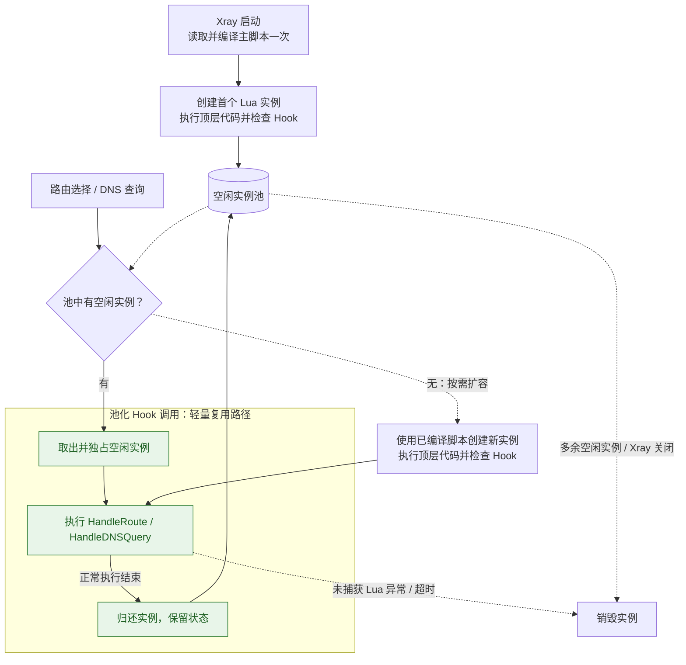

# 实例与生命周期

Lua 实例的创建、Hook 调用、状态保留和销毁，由脚本入口采用的实例管理方式决定。本页按生命周期类型说明这些规则。

## 池化生命周期

当前[路由脚本](./routing.md)的 [HandleRoute](../reference/hook-routing.md) 和 [DNS 脚本](./dns.md)的 [HandleDNSQuery](../reference/hook-dns.md) 使用池化实例。以下规则适用于这两个 Hook。

### 实例池与初始化

路由脚本和 DNS 脚本分别通过对应配置中的 `script` 绑定脚本，各自管理独立的 Lua 实例池。即使配置为同一个文件，也不会共享 Lua 实例内的状态。

Xray 启动时会读取并编译脚本一次，然后创建第一个实例，执行脚本顶层代码，检查必需的处理函数是否存在。文件读取、语法、顶层执行或处理函数检查失败时，Xray 启动失败。

### Hook 调用与回收

每次路由选择或 DNS 查询独占一个实例。有空闲实例时直接复用；并发调用需要更多实例时，使用已编译的脚本创建新实例，并重新执行顶层代码。

处理函数正常执行完成后，实例可归还池中复用；未捕获的 Lua 异常或执行超时会使实例被销毁。处理函数通过返回值报告业务错误，或返回值校验失败，并不等同于 Lua 执行异常，实例仍可复用。多余的空闲实例会自动被销毁。

有空闲实例时，每次 Hook 的调度路径很轻：**取出实例 → 执行 Hook → 归还实例**。脚本读取与编译在 Xray 启动时完成。图中的绿色节点表示这条常规路径。



### 池化实例内状态

全局变量、顶层 `local`、闭包和 `require` 的模块缓存属于当前实例，会在该实例处理的多次调用之间保留，实例销毁时丢失：

```lua
local calls = 0

function HandleRoute()
    calls = calls + 1
    return "direct", "instance-call-" .. calls
end
```

上面的计数只表示当前实例处理过的调用次数。不同实例有独立的 `calls`，请求也不保证总是分配到同一个实例。它不能用作所有连接共享的计数器或某条连接的持续状态。

建议将加载 Lua 模块、创建匹配器、保存 DNS 服务器对象等初始化代码放在 Hook 函数外（脚本顶层）。这些代码在每个实例创建时执行一次，结果可供同一实例后续的 Hook 调用复用。

### 超时与脚本更新

当前路由和 DNS 的每个实例初始化超时为 **120 秒**，每次处理函数调用的执行超时为 **6 秒**。调用超时从取得实例后开始计算；这些值目前没有独立的配置字段。调用 Xray API 时，实际取消行为还取决于 API 是否响应取消信号；单台 DNS 服务器还受其 `timeoutMs` 限制。

Xray 不自动监视或重新编译主脚本。修改主脚本后，应重启 Xray 使其生效；之后创建的新实例也使用本次启动时编译的主脚本。
